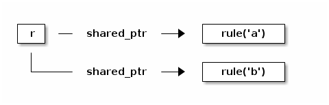
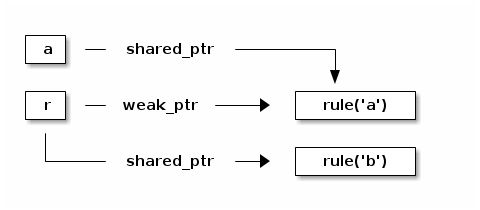

TiPa : a Tiny Parser in C++
---------------------------

Author: Giuseppe Lipari (giuseppe.lipari@univ-lille1.fr)

## Table of contents ## 

<ol>
<li><a href="#sec-1">Introduction</a></li>
<li><a href="#sec-2">Tutorial</a></li>
<li><a href="#sec-3">Note on the memory strategy</a></li>
</ol>

## Introduction ##

This is a library for implementing simple parsers in C++.  Since I
often build simulators, tools for analysis, and recently also a
small model checker, I often need to read a configuration file with
various formats. Therefore, after looking around, I decided to try
to use the Boost::Spirit parser.

I have to say that I have mixed feelings about Spirit: I love the
concise syntax of the rules, the flexibility, and the many features
and tools available. However, I hate the steep learning curve, and I
hate the fact that, every time I try to use it, I lose so much time
in debugging.

Therefore, I decided to write a very simple library as a replacement
for Spirit. I tried to keep the same *spirit* and use a simple
technique to write the rules in a simil-BNF style. However, the
enphasis is in simplicity of use, therefore I kept the set of
features to a minimal level, and most importantly, I did not try to
optimize the parsing process.

If you have to write a simple parser for a short file, and create a
simple AST, this may be the library you need, give it a try!

It uses the C++11 syntax, so make sure to use an up-to-date
compiler. In particular, I am currently working with the following
compiler:

    g++ (Ubuntu/Linaro 4.8.1-10ubuntu9) 4.8.1

I cannot guarantee the library will compile on any other system,
sorry. If you have troubles compiling with your own compiler, drop
me an e-mail and I will see what I can do.

-   To compile and install, just go trough the usual 
    
        ./configure && make && make install

-   You can run the tests with 
    
        make check
    
    or simply by running the test program:
    
        ./test/test

-   Two examples are available in example/arithmetic and
    example/tinyjson

Have fun!

## Tutorial ## 

To be done.

##  Note on the memory strategy ## 

The rule class implementation internally uses either shared\_ptr or
weak\_ptr pointers for holding references to other rules. It works as
follows:

-   If a rule consists of two rules created on the fly (as C++
    rvalues), then it uses shared\_ptr to hold ownership on these
    rules. For example:
    
        rule r = rule('a') >> rule('b');
    
    In this case, `rule('a')` and `rule('b')` are *rvalues* in the
    expression on the right of the assigment, therefore, another
    temporary object is built that holds the ownership of these two,
    and then this is assigned to rule r. In the end, `r` has ownership
    of the other two rules. Here is a graphical representation:

    

-   Consider this second example:
    
        rule a = rule('a');
        rule r = a >> rule('b');
    
    In this case, the sequence expression on the right refers to a
    *lvalue object* (`rule a`) and a *rvalue*; therefore, for the
    first one we use a `weak_ptr`, NOT taking ownership, whereas for
    the second we use a `shared_ptr`, and we do take ownership. Here is
    the structure:
    
    

	Please, notice that if `a` goes out of scope before `r`, then the
	memory for `rule('a')` is freed, and you get an exception when
	parsing r.

-   If you know what you are doing, and you want to release a before
    r, you can transform the lvalue into a rvalue by using
    =std::move()=. Here is the example;
    
        rule r;
        {
            rule a = rule('a');
            rule r = std::move(a) >> rule('b');    
            // *1*
        } 
        // *2*
    
    In this case, the structure at point **1** is the following:
    
    
    
    and at point **2** it becomes the same as in the first case.
